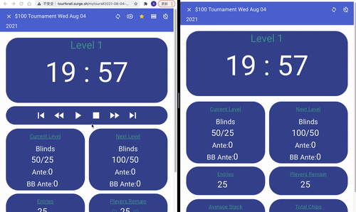
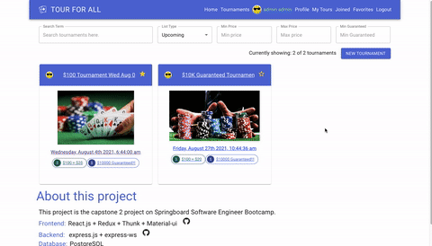
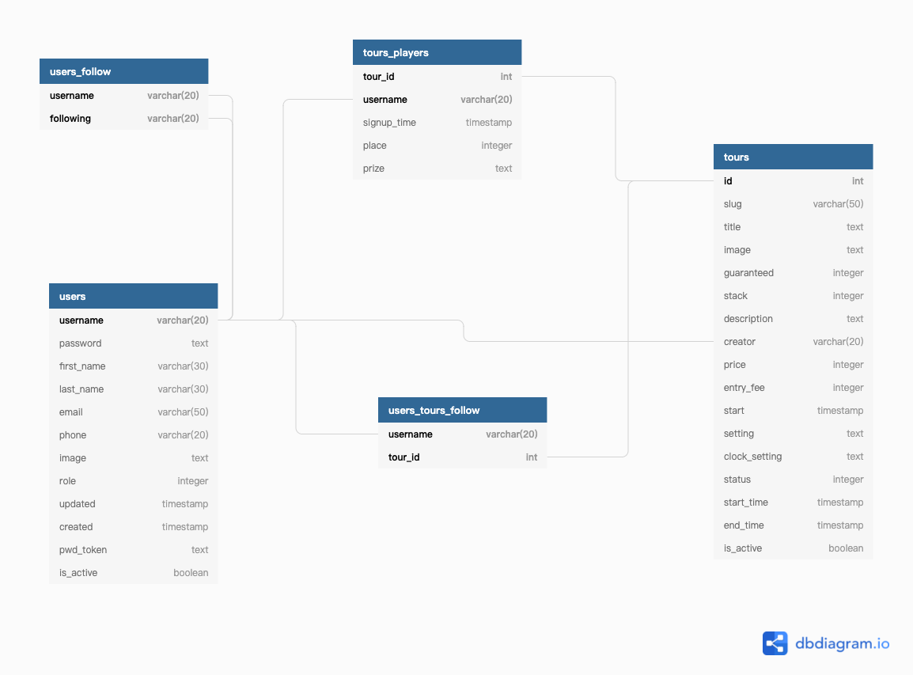

# Tour For All

I have been working as a poker dealer for over 10 years. Every day I work I need to deal with poker tournaments and looking at the tournament clocks all the time. An idea came up to me I want to make my tournament clock one day and share it with everyone.

Here is the project. Everyone can find tournaments and see the real-time updated clocks online. Tournament hosts can run the same tournament in different rooms even in different cities, everyone would see the same clock with the same information no matter where you are.


## Authors

Sunbao Wu[@yb7984](https://www.github.com/yb7984)  
Email: [bobowu@outlook.com](mailto:bobowu@outlook.com)  
Linkedin: [https://www.linkedin.com/in/sunbao-wu/](https://www.linkedin.com/in/sunbao-wu/)


## Tech Stack
[](https://nodejs.org/en/)
[](https://reactjs.org/)
[](http://expressjs.com/)
[](https://www.postgresql.org/)

[](https://github.com/facebook/create-react-app)
[](https://testing-library.com/docs/react-testing-library/intro/)
[](https://reactrouter.com/web/guides/quick-start)
[](https://redux.js.org/)
[](https://github.com/rt2zz/redux-persist)
[](https://github.com/reduxjs/redux-thunk)

[](https://material-ui.com/)
[](https://www.npmjs.com/package/jsonwebtoken)
[](https://github.com/axios/axios)
[](https://momentjs.com/)

[](https://aws.amazon.com/s3/)
[](https://www.npmjs.com/package/bcrypt)
[](https://www.npmjs.com/package/jsonschema)
[](https://www.npmjs.com/package/express-ws)
[](https://www.heroku.com)
[](https://surge.sh/)

  
## Demo
- [Tour For All Frontend](http://tourforall.surge.sh/) hosted on [Surge](https://surge.sh/)
- [Tour For All Backend](https://tourforall.herokuapp.com/) hosted on [Heroku](https://www.heroku.com/)


## Github
- Frontend: [tour-for-all-react](https://github.com/yb7984/tour-for-all-react)
- Backend: [tour-for-all-express](https://github.com/yb7984/tour-for-all-express)

## Screen shot & Video
- Running Clock
  
  []

- Copy Tournament
  
  []
  
  
## Components

Please check it out at [tour-for-all-react](../tour-for-all-react).

## Database schema




## API Reference

- ### Authorization

  - #### Login
Returns JWT token which can be used to authenticate further requests.

```http
  POST /auth/token
```
##### Request **JSON Body**

```json
{
  "username": "your username",
  "password": "your password" 
}
```

##### **Response**

if successfully login, return status 201

```json
{
    "token": "Your token"
}
```

else 

```json
{
    "error": {
        "message": "Invalid username/password",
        "status": 401
    }
}
```

  - #### Register
Returns JWT token which can be used to authenticate further requests.

```http
  POST /auth/register
```
##### Request **JSON Body**

```json
{
  "username": "your username",
  "password": "your password",
  "firstName": "first name", 
  "lastName": "last name", 
  "email": "email"
}
```

##### **Response**

if successfully, return status 201

```json
{
    "token": "Your token"
}
```

else 

```json
{
    "error": {
        "message": "Duplicate username:<your username>",
        "status": 400
    }
}
```


- ### Users

  - #### List
Returns list of all users.

##### Authorization required: login as `admin`

```http
  GET /users
```
##### Request **JSON Body**

```json
{}
```

##### **Response**

```json
{
  users: [user1, user2]
}
```


  - #### Get
Returns User.

##### Authorization required: `none`

```http
  GET /users/:username
```
##### Request **JSON Body**

```json
{}
```

##### **Response**

```json
{
  user: User
}
```


  - #### Insert
Adds a new user.This returns the newly created user and an authentication token for them.

##### Authorization required: login as `admin`

```http
  POST /users
```
##### Request **JSON Body**

```json
{
  "username": "your username",
  "password": "your password",
  "firstName": "first name", 
  "lastName": "last name", 
  "email": "email",
  "role": 0 or 1
}
```

##### **Response**

if successfully, return status 201

```json
{
    "user": User
    "token": "Your token"
}
```

else 

```json
{
    "error": {
        "message": "Bad Request",
        "status": 400
    }
}
```

```json
{
    "error": {
        "message": "Duplicate username:",
        "status": 400
    }
}
```


  - #### Update
Update a user.This returns the updated user.

##### Authorization required: login as `admin` or `current user`

```http
  PATCH /users/:username
```
##### Request **JSON Body**

```json
{
  "password": "your password",
  "firstName": "first name", 
  "lastName": "last name", 
  "email": "email",
  "phone":"XXXXXXXXXX",
  "image":"image",
  "role": 0 or 1
}
```

##### **Response**

if successfully, return status 200

```json
{
    "user": User
}
```

else 

```json
{
    "error": {
        "message": "Bad Request",
        "status": 400
    }
}
```


  - #### Delete

Delete a User

##### Authorization required: login as `admin` or `current user`

```http
  DELETE /users/:username
```
##### Request **JSON Body**

```json
{
}

##### **Response**

```json
{
  "deleted": username
}
```
OR 

if this user has joined or created some tournaments
```json
{
  "deactivated": username
}
```


- ### Tours

  - #### List
Returns list of tours.

##### Authorization required: `none`

```http
  GET /tours
```
##### Request **Query String**

| param           | value                                                           |
| :-------------- | :-------------------------------------------------------------- |
| `listType`      | any of private,joined,upcoming,all,running,past,cancel,favorite |
| `username`      | current username                                                |
| `term`          | search term                                                     |
| `creator`       | username of tournament creator                                  |
| `isActive`      | true or false                                                   |
| `status`        | any of 0,1,9,10                                                 |
| `minPrice`      | minimum price, must be 0 or greater                             |
| `maxPrice`      | maxmum price, must be 0 or greater                              |
| `minGuaranteed` | minimum guaranteed, must be 0 or greater                        |
| `maxGuaranteed` | minimum guaranteed, must be 0 or greater                        |
| `page`          | current page, must be 1 or greater                              |
| `perPage`       | record per page, must be 1 or greater                           |

##### **Response**

```json
{
  tours: [tour1, tour2 , ....],
  page,
  total,
  perPage
}
```


  - #### Get
Returns Tour.

##### Authorization required: `none`

```http
  GET /tours/:handle
```

handle can be id or slug


##### Request **JSON Body**

```json
{}
```

##### **Response**

```json
{
  tour: Tour
}
```


  - #### Insert
Adds a new tour.This returns the newly created tour.

##### Authorization required: `login`

```http
  POST /tours
```
##### Request **JSON Body**

```json
{
  "slug": "tour slug",
  "title": "title",   // required
  "image": "image", 
  "guaranteed": "guaranteed prize pool, integer of 0 or greater", 
  "stack": "chip stack, integer of 1 or greater",
  "description": "description",
  "price": "purchase price, integer of 0 or greater",
  "entryFee": "entry fee, integer of 0 or greater",
  "start": "start time of tour, string of datetime",  //required
  "setting": "stringified json object",
}
```

##### **Response**

if successfully, return status 201

```json
{
    "tour": Tour
}
```

else 

```json
{
    "error": {
        "message": "Bad Request",
        "status": 400
    }
}
```


  - #### Update

Update a tour. This return a updated Tour.

##### Authorization required: login as `admin` or `creator`

```http
  PATCH /tours/:handle
```
##### Request **JSON Body**

```json
{
  "slug": "tour slug",
  "title": "title",   
  "image": "image", 
  "guaranteed": "guaranteed prize pool, integer of 0 or greater", 
  "stack": "chip stack, integer of 1 or greater",
  "description": "description",
  "price": "purchase price, integer of 0 or greater",
  "entryFee": "entry fee, integer of 0 or greater",
  "start": "start time of tour, string of datetime",  
  "setting": "stringified json object",
  "clockSetting": "stringified json object",
  "status": "tour status, integer",
  "isActive": true or false
}
```

##### **Response**

if successfully, return status 200

```json
{
    "tour": Tour
}
```

else 

```json
{
    "error": {
        "message": "Bad Request",
        "status": 400
    }
}
```


  - #### Delete
Delete a Tour.

##### Authorization required: login as `admin` or `creator`

```http
  DELETE /tours/:handle
```
##### Request **JSON Body**

```json
{
}

##### **Response**

```json
{
  "deleted": tourId
}
```
OR 

if this tour has started
```json
{
  "deactivated": tourId
}
```


  - #### Follow
Follow a Tour.

##### Authorization required: login as `admin` or `current user`

```http
  POST /tours/:handle/follow/:username
```
##### Request **JSON Body**

```json
{
}

##### **Response**

```json
{
  "defollow": tourId
}
```


  - #### Defollow
Defollow a Tour.

##### Authorization required: login as `admin` or `current user`

```http
  DELETE /tours/:handle/follow/:username
```
##### Request **JSON Body**

```json
{
}

##### **Response**

```json
{
  "follow": tourId
}
```

- ### TourPlayers
  - #### Insert
Attend a tour

##### Authorization required: login as `admin` or `current user`

```http
  POST /tours/:handle/players/:username
```
##### Request **JSON Body**

```json
{
}

##### **Response**

```json
{
  "player": TourPlayer
}
```


  - #### Update
Update a tour player

##### Authorization required: login as `admin` or `creator`

```http
  PATCH /tours/:handle/players/:username
```
##### Request **JSON Body**

```json
{
  "prize": "the prize the player got",
  "place": "Integer, the place of the player got at the tour"
}

##### **Response**

```json
{
  "player": TourPlayer
}
```


  - #### Delete
Unattend a tour

##### Authorization required: login as `admin` or `creator`

```http
  DELETE /tours/:handle/players/:username
```
##### Request **JSON Body**

```json
{
}

##### **Response**

```json
{
  "deleted": username
}
```

- ### Clocks

  - #### Get Connection
```http
  WS /tours/:handle/clock
```
Messages

    - Join
```json
{
  "type": "join",
  "name": "username" or uuid(),
  "clockManager": true or false
}
```


    - Sync
```json
{
  "type": "sync",
  "data": Clock
}
```

## Environment Variables

To run this project, you will need to add the following environment variables to your .env file
| param                   | default value                                                 | description                                |
| :---------------------- | :------------------------------------------------------------ | ------------------------------------------ |
| `SECRET_KEY`            | secret-dev                                                    | Secret key for this app                    |
| `PORT`                  | 3002                                                          | the port running for this app              |
| `NODE_ENV`              |                                                               | set to "test" when doing the test          |
| `DATABASE_URL`          | tour_for_all_test when testing, tour_for_all when not testing |                                            |
| `UPLOAD_DIR`            | uploads                                                       | the folder name for uploading data         |
| `UPLOAD_URL`            | /uploads                                                      | the url for upload folder                  |
| `S3_UPLOAD`             | false                                                         | if the app using amazon s3 to upload image |
| `AWS_ACCESS_KEY_ID`     |                                                               | access key id for amazon service           |
| `AWS_SECRET_ACCESS_KEY` |                                                               | access key for amazon service              |
| `AWS_S3_BUCKET`         | tourforall                                                    | amazon s3 bucket name                      |


  


